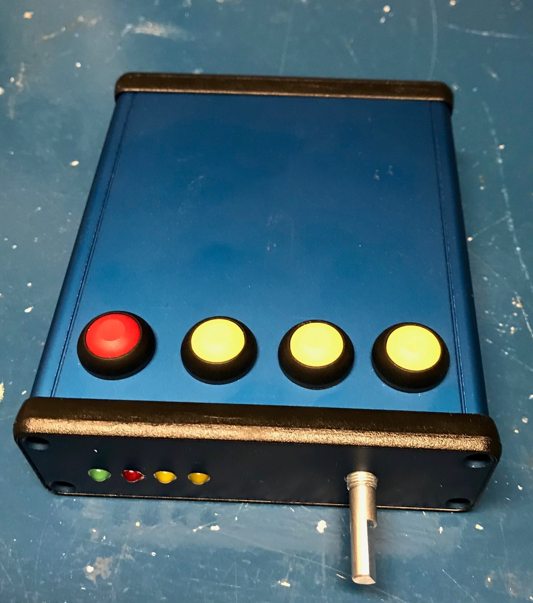
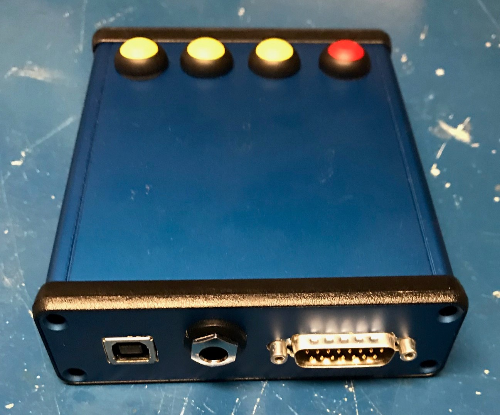
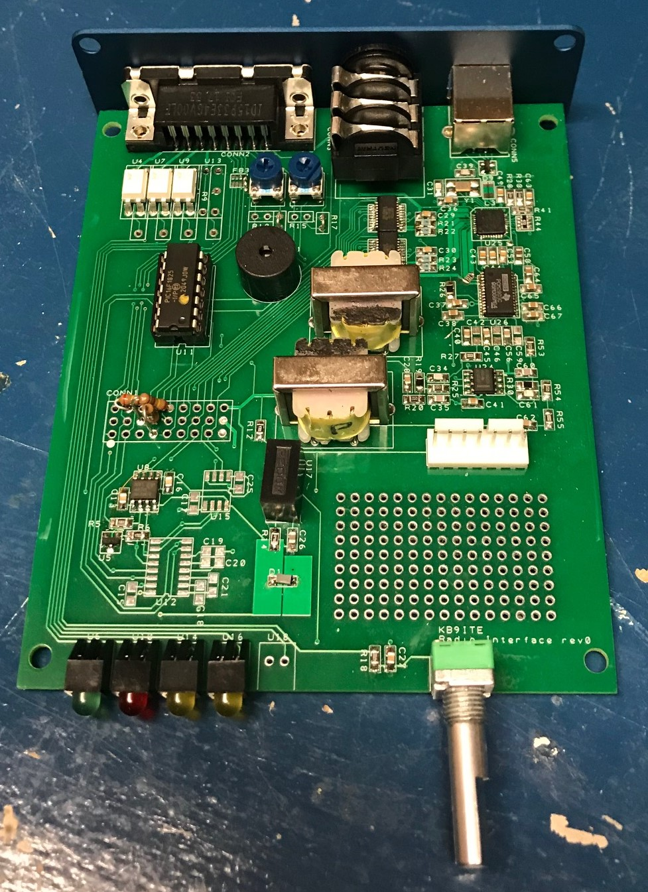
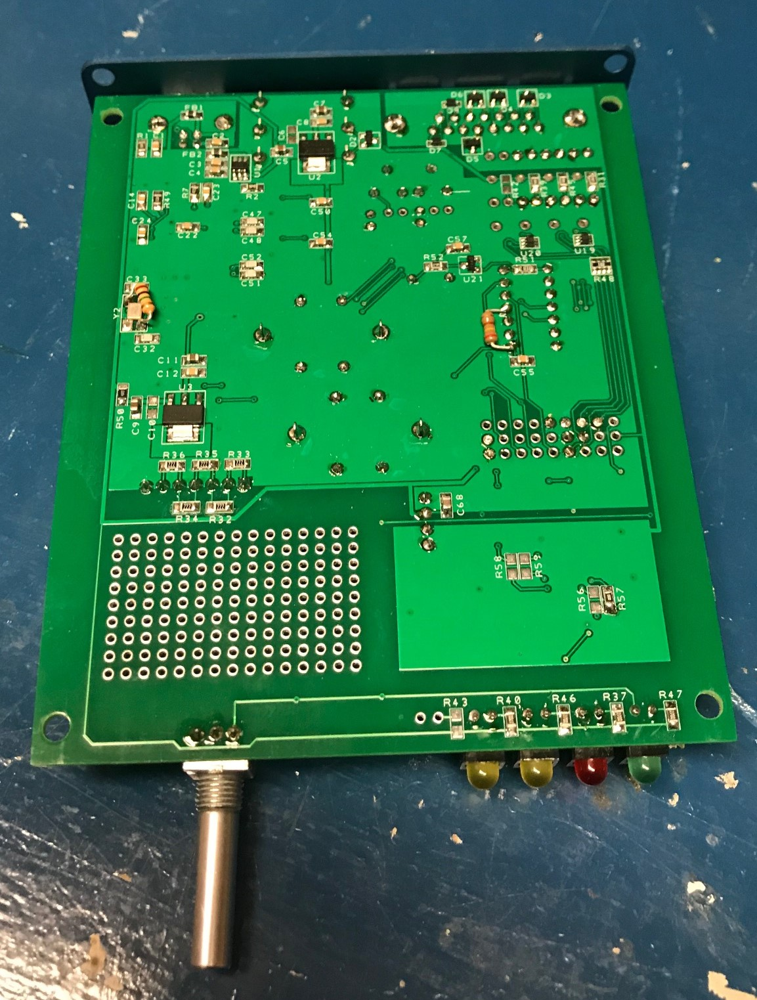

# Radio Interface
  

## Introduction
I've been a ham for a while, growing up the son of a ham, I had a pretty nice setup readily available.  After some time away from the hobby I found myself getting back into it and starting to put together my own station.  I quickly realized I was going to want to interface the radio with the computer.  As I started to breakdown my needs I came up with the following:

 - Rx and Tx audio to run digital modes
 - PTT so I could avoid using Vox and transmitting computer sounds I shouldn't
 - FSK to dabble in RTTY
 - CW Key thinking I might learn morse code again
 - Serial so that I could get the bandmap working on my PC

Taking a look around there are a number of good options for off the shelf interfaces, although non had all the functionality I was looking for in one box.  Being a DIY kind of person (and frugal) and having some experience with PCB design and assembly I figured I would just build my own.  A little bit of searching around showed that there were single chip solutions for a USB sound card and I had already used USB to serial devices in previous projects.  Armed with that information I set out looking for a design to build.  I figured surely someone has shared a design where they through a USB hub, USB audio codec and USB to serial adapter on a single PCB, right?  All of my searching produced nothing, so I decided to design one myself.

This project represents the results of that effort.  It is a single box solution that includes a sound card, 2 serial ports, a WinKeyer and galvanic isolation between the radio and PCB.
## Design
The general design philosophy I used was to try and make the design flexible to be adapted to other people's uses without requiring PCB changes.  To that end there are some optional components and a jumper area for some configuring.

Starting with the computer end, the design includes a 3 port USB hub to allow a single USB connection to the PC.  This connects the audio coded (TI PCM2903C) and 2 USB to serial chips (FTDI FT231XS).

One of the serial ports is setup for communication with the radio.  A pair of digital isolators are used to provide galvanically isolated TTL level Rx, Tx, RTS and CTS signals.  If this is the desired output some jumpers can be installed and these signals will be at the radio connector.  If RS232 levels are needed there is provision for an RS232 level shifter or if an ICOM CI-V interface is needed there is space for a simple transistor to provide the open collector style single wire serial.  The polarity of the inputs/outputs on the serial interface can be changed using the FT_Prog utility from FTDI.

The second serial port allows control of an onboard WinKeyer3 IC from K1EL.  All the required peripherals to support the WinKeyer are included on board (speed pot, push button inputs and side tone speaker).

The audio support mono input/output.  By populating/depopulating a few parts the input/output channel can be changed as the PCM2903 is a stereo codec.  I built mine to just use left channel audio.  From the codec there is a second order low pass filter and then transformer for isolation.  On the radio side of the audio is provision for a fixed pad and a trimmer.  The fixed pad is intended to be used if a significant level shift is needed from line to mic or speaker to line levels.  The trimmer allows fine tuning of the levels to match the transceiver and computer.  The trimmer pots are inside the device so they are intended for a set it and forget it setup and regular fine tuning can be done either with radio controls (if available) or with the volume controls on the computer.

The outputs section supports up to 4 control outputs to the radio.  These can be used for whatever is desired (PTT, Key, FSK,...).  The outputs are designed to support either a optocoupler or reed relay for isolation of the outputs.  There is also the option of a front panel LED for each output to allow monitoring the output statuses.  The function of each output is selected through installing jumpers in the jumper area.  Signals available for the outputs include:

- All WinKeyer outputs (PTT1/2, Key 1/2)
- Both Serial Port (Tx, Rx, RTS, CTS, DTR)

The idea here is to make it easy for someone to build the box to his/her needs when building the device  by installing the desired set of jumpers on the prototyping connector.
|  |  |  |  |  |  |  |  |  |
|--|--|--|--|--|--|--|--|--|
|3-CAT_CTS|6-Out2Ctrl|9-Out4Ctrl|12-P1Key|15-P2PTT|18-Ser1_DTR|21-Ser1_CTS|24-Ser2_DTR|27-3.3V
|2-OutCom|5-CAT_Tx|8-Out3Ctrl|11-P1PTT|14-P2Key|17-Ser1_RTS|20-Ser2_Tx|23-Ser2_RTS|26-5V
|1-CAT_RTS|4-CAT_Rx|7-GND|10-Out1CTRL|13-Ser1_Tx|16-Ser1_Rx|19-Ser2_Rx|22-Ser2_CTS|25-GND

The interface to the radio is done with a DB15 connector.  The pinout is as follows:

 1. Rx Audio -
 2. Tx Audio -
 3. CAT_Rx
 4. CAT_CTS
 5. Out4
 6. Out3
 7. Out2
 8. Out1
 9. Rx Audio +
 10. Tx Audio +
 11. CAT_Tx
 12. CAT_RTS
 13. Out Common
 14. Out Common
 15. Out Common
 
   
